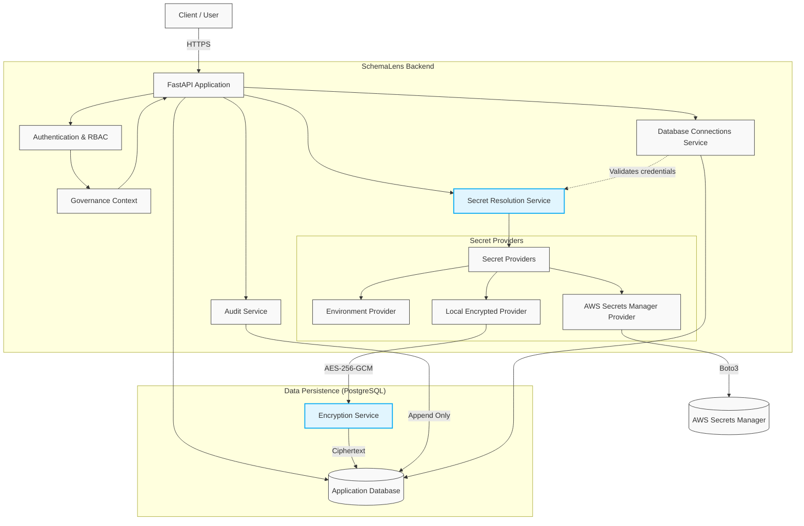

# SchemaLens

SchemaLens is a secure AI-powered database intelligence and query-governance platform. 

It provides an intelligent abstraction layer over customer databases, allowing teams to query databases securely using AI without exposing raw credentials, bypassing governance policies, or writing unvalidated SQL directly.

## Features (Implemented)

SchemaLens is being built systematically in "bricks". The following capabilities are fully implemented:

* **Authentication & Identity**: Secure JWT-based authentication with peppered refresh tokens.
* **Multi-Tenant Organizations**: Strong isolation of resources via Organizations and Role-Based Access Control (RBAC).
* **Append-Only Audit Trail**: Immutable logging of all sensitive actions, connection lifecycle events, and credential usage.
* **Database Connection Profiles**: Extensible connection profiles tracking environments, dialects, and strict SSL validation modes.
* **Connection Policies**: Secure default connection policies per database.
* **Secret Provider Abstraction**: Extensible secrets management.
* **Local Encrypted Secrets**: Robust local encryption of credentials using AES-256-GCM with deterministically bound Additional Authenticated Data (AAD) to prevent cross-tenant credential swapping.
* **AWS Secrets Manager Integration**: Optional integration to securely resolve external secrets using AWS Secrets Manager.

## Architecture

- **Backend Framework:** FastAPI (Python)
- **Database ORM:** SQLAlchemy (Async)
- **Database Driver:** asyncpg (PostgreSQL)
- **Validation:** Pydantic V2
- **Cryptography:** Cryptography (AES-256-GCM)
- **Cloud Integration:** Boto3 (AWS)

### Architecture Diagram



### Project Structure

- `backend/app/api`: FastAPI route handlers and dependencies.
- `backend/app/models`: SQLAlchemy ORM models.
- `backend/app/schemas`: Pydantic validation schemas.
- `backend/app/services`: Core business logic (e.g., authentication, database connections, auditing).
- `backend/app/secrets`: Secret provider implementations (Local Encrypted, Environment, AWS).
- `backend/app/repositories`: Database access patterns and logic.
- `backend/app/governance`: RBAC, permissions, and multi-tenant isolation context.
- `backend/app/audit`: Append-only audit trail implementations.

## Development

### Requirements
- Python 3.11+
- PostgreSQL 15+

### Setup

1. Copy `.env.example` to `.env` and fill out the configuration variables.
2. If using local encrypted secrets, you must generate a secure master key:
   ```bash
   python backend/scripts/manage_local_secret.py generate-key
   ```
   Add this key to your `.env` file under `LOCAL_SECRET_MASTER_KEY`.
   **Warning:** Never commit the `.env` file or the master key to version control.

3. Install dependencies using standard Python package managers (or `hatch` if configured). Include optional dependencies like AWS if required:
   ```bash
   pip install -e "backend[aws]"
   ```